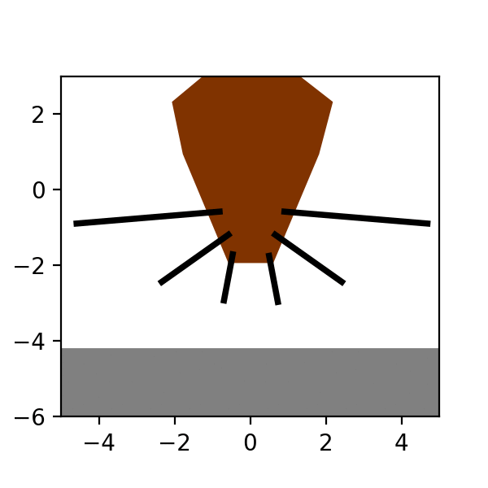
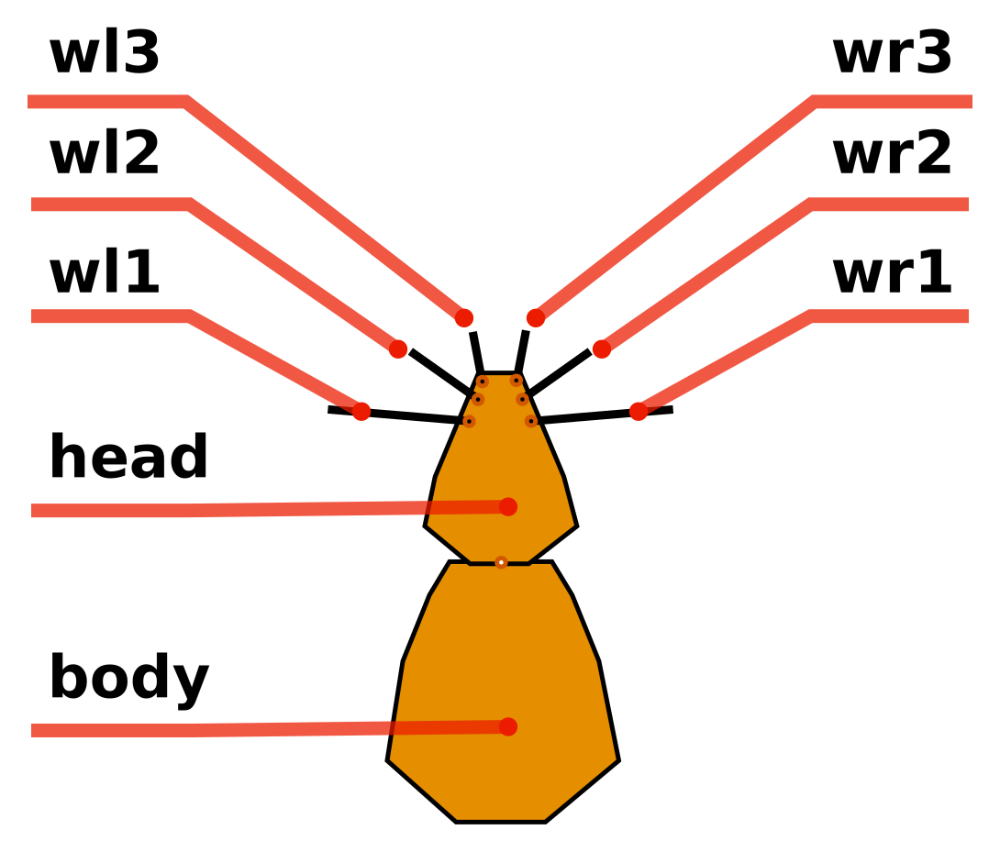

# RatSim

A simple rat simulation with whiskers using  [gym](http://gym.openai.com/) environment and [pybox2d](https://github.com/pybox2d/pybox2d/wiki/manual) as the physics engine and [matplotlib](https://matplotlib.org/) for graphics.

## Table of contents
* [Install](#install)
* [Basic usage](#basic-usage)

## Install

1. Download the RatSim repo:

       git clone https://github.com/francesco-mannella/RatSim.git

2. Install the RatSim package:

       cd ratsim
       pip install -e .

## Basic usage

### Wall scenario

    import gym
    import RatSim

    env = gym.make('RatSim-v0')

    for t in range(10):  
      env.render()
      observation = env.step(env.action_space.sample())

#### rendering

The two possible values of the argument to be passed to env.render() are:
* "human": open a matplotlib figure and update it at each call.
* "offline": save a frame into a png file at each call. Files are saved into the local folder 'frames'. This  folder is created if it does not exist.

<table>
       <tr>
              <td align="center">
                     
             </td>
       </tr>
       <tr>
              <td align="center">
                     Example in <a href="RatSim/examples/test.py">test.py</a>
              </td>
       </tr>
</table>

#### Actions

The action attribute of env.step must be a vector of 9 float elements. Elements in the first 6 indices give the current amplitude of oscillation for each of the 6 whiskers. the 7th index defines the current joint angle of the body-to-head joint. the 8th index defines the angular velocity of the rat. The 9th index defines the speed in the current straight direction.

<TABLE width="100%" BORDER="0">
<TR>
<TD>

| index |  joint name            |
| ----- | ---------------------- |
|  0    |  head_to_wl1           |
|  1    |  head_to_wl2           |
|  2    |  head_to_wl3           |
|  3    |  head_to_wr1           |
|  4    |  head_to_wr2           |
|  5    |  head_to_wr3           |
|  6    |  body_To_head          |

</TD>
<TD></TD>
</TR>
</TABLE>

#### Observations

The observation object returned by env.step is a dictionary:

* observation["JOINT_POSITIONS"] is a vector containing the current angles of the 7
 joints
* observation["TOUCH_SENSORS"] is a vector containing the current touch intensity at the six touch sensors (see figure below)
* observation["OBJ_POSITION"] coordinates of the center of mass of the external object

#### Reward

The reward value returned by env.step is always put to 0.

#### Done

The done value returned by env.step is always set to False.

#### Info

The info value returned by env.step is always set to an empy set {}.
  .
